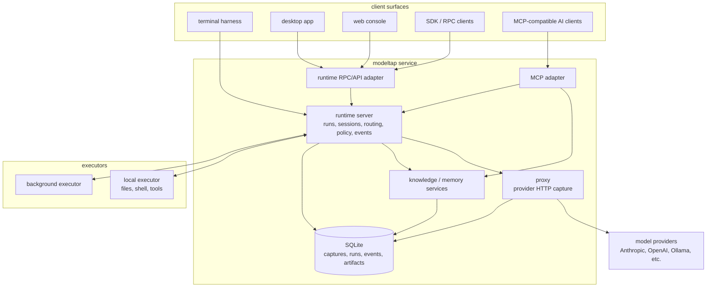

# ADR-0016: Runtime Server and Client Surfaces

## Context and Problem Statement

Modeltap's server-side harness component was originally named the runtime server
(orchestration runtime), because the first client surface was the terminal
harness. That name is now too narrow. The same component owns durable runs,
sessions, routing, policy, event streams, checkpoints, artifacts, and
tool-result integration for terminal, GUI, web, API/RPC, MCP, and future agentic
clients.

The project needs one architecture vocabulary that describes the component by
what it owns rather than by the first frontend that used it.

## Decision Drivers

- **D1 - Conceptual accuracy:** Names should describe ownership of orchestration
  and execution semantics.
- **D2 - Multi-surface fit:** The vocabulary must work for terminal, desktop,
  web, RPC, SDK, MCP, and future agent clients.
- **D3 - Local-first clarity:** The user-facing process model should remain
  simple: one local modeltap service can host several internal components.
- **D4 - Implementation directness:** There are no current external users, so
  the rename should be clean rather than compatibility-heavy.
- **D5 - Future constraint value:** Future features and ADRs should not
  re-litigate whether this component is a frontend-specific backend.

## Considered Options

- Keep runtime server.
- Rename to harness server.
- Rename to orchestration server.
- Rename to runtime server.
- Rename to control plane.

## Decision Outcome

Chosen option: **runtime server**.

The runtime server is the modeltap component that owns durable execution state:
runs, sessions, model routing, prompt/context planning, policy integration,
event streams, checkpoints, artifacts, and tool/result correlation. The terminal
harness remains one client surface over this runtime, not the reason the server
exists.

The old runtime server terminology is retired for live source, active docs, config, and
user-facing output. Because there are no current external users, no compatibility
aliases are added.

### Canonical Vocabulary

- **modeltap service:** the local process that may host the proxy, runtime
  server, storage, knowledge/memory services, API adapters, and MCP adapter.
- **runtime server:** the authoritative orchestration runtime for sessions,
  runs, lifecycle state, routing, policy, event replay, checkpoints, artifacts,
  and tool-result integration.
- **proxy:** the provider HTTP reverse proxy and capture path.
- **client surface:** a human or programmatic client over the runtime server,
  including terminal harness, desktop app, web console, SDK/RPC client, and
  MCP-compatible AI client.
- **terminal harness:** the Bubble Tea attached terminal client.
- **runtime RPC API:** the programmable control surface for creating,
  inspecting, attaching, detaching, cancelling, retrying, forking, and replaying
  runs.
- **MCP adapter:** the AI-client tool/resource surface, especially for
  knowledge and context access.
- **executor:** a local or background component that performs filesystem,
  shell, and other side-effecting tool work and reports results to the runtime
  server.

### Configuration and Source Names

The clean-cut names are:

- config namespace: `runtime`
- environment variables: `MODELTAP_RUNTIME_*`
- Go package: `internal/runtime`
- feature spec: `FEAT-0008: Runtime Server`
- user-facing text: `runtime server`

The following names are not retained as live aliases:

- `runtime`
- `runtime server`
- `MODELTAP_RUNTIME_*`

## Architecture Diagram

## Consequences

- Good, because the server is named after its durable execution role rather than
  one frontend.
- Good, because GUI, web, API/RPC, SDK, and MCP clients now fit the same
  architecture vocabulary as the terminal harness.
- Good, because config and source names align with the accepted run-runtime
  ownership in ADR-0015.
- Bad, because historical docs and older release artifacts will still contain
  runtime server terminology unless individually revised.
- Neutral, because JSON-RPC method names do not need terminology changes:
  `run.*`, `session.*`, `turn.*`, `tool.result`, and `model.*` are already
  domain names rather than runtime server names.

## Confirmation

This decision is confirmed when:

1. Live source uses `internal/runtime` and the `runtime` config namespace.
2. Active user-facing docs refer to the runtime server instead of runtime server.
3. FEAT-0008 is titled and framed as the Runtime Server feature.
4. Existing tests pass with no runtime server compatibility aliases.
